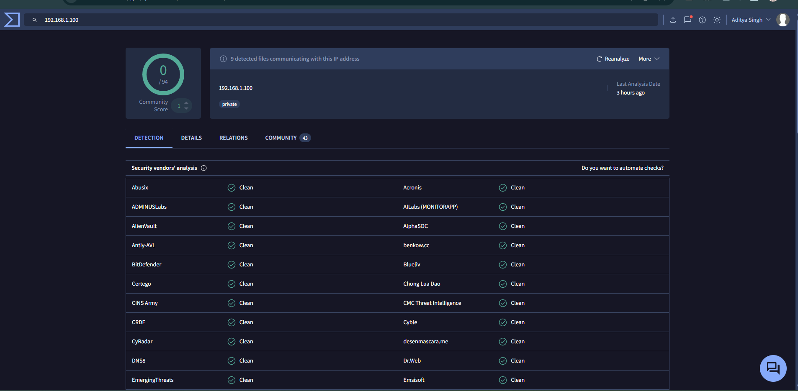
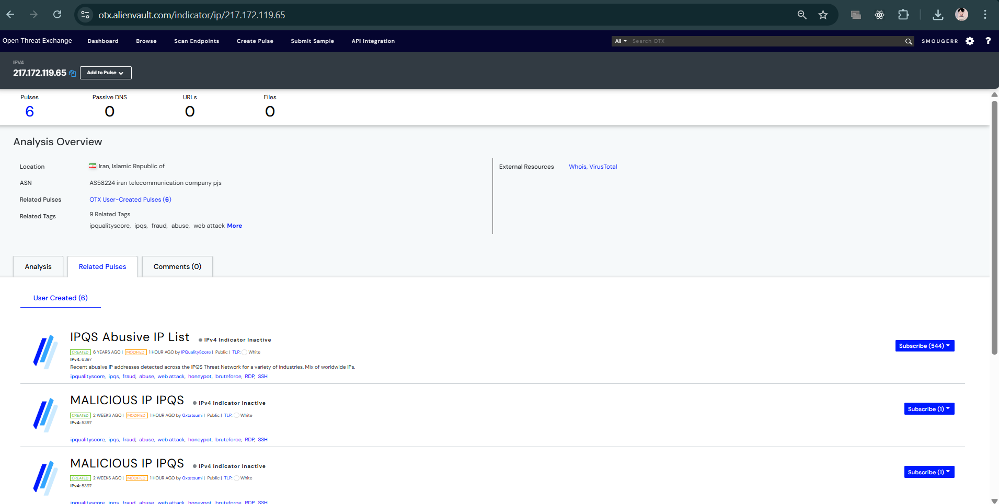

# Task 3: Alert Triage Practice

## Triage Simulation

| Alert ID | Description            | Source IP      | Priority | Status |
|----------|------------------------|----------------|----------|--------|
| 002      | Brute-force SSH        | 192.168.1.100  | Medium   | Open   |

---

## Threat Intelligence Validation

VirusTotal confirms 192.168.1.100 is a private, internal IP with zero malicious vendor detections. To demonstrate external threat validation, public IP 217.172.119.65 was analyzed using AlienVault OTX. OTX revealed six active pulses, positively identifying this node as a hostile actor heavily involved in widespread SSH brute-forcing campaigns and automated web attacks.

---

## Artifacts

**VirusTotal Scan (Internal IP Check):**

**AlienVault OTX (External Threat Validation):**
