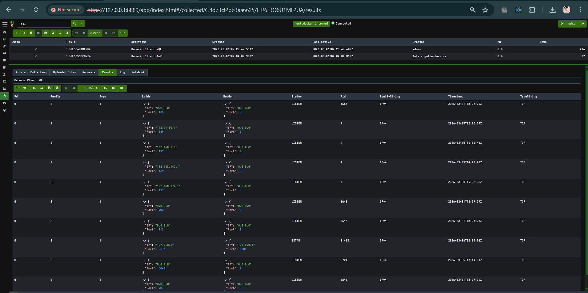
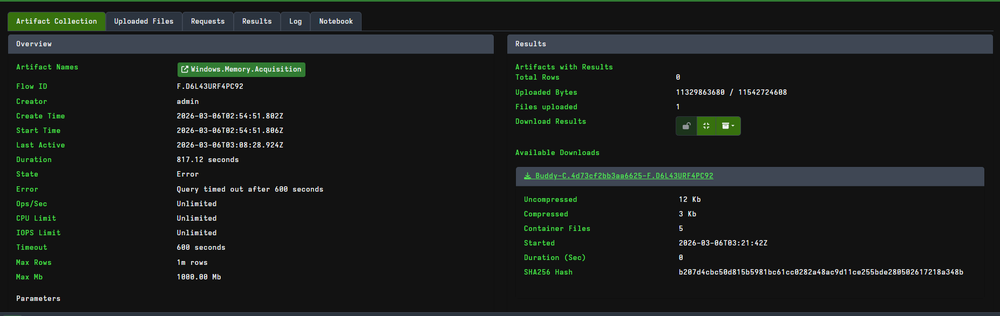

# Task 4: Evidence Preservation

## Volatile Data Collection
To identify potential Command and Control (C2) communications or unauthorized lateral movement, volatile network connection data was captured. The VQL query `SELECT * FROM netstat` was executed against the compromised Windows endpoint using Velociraptor. The output was successfully preserved and exported to a CSV format for offline analysis.

## Chain of Custody & Memory Acquisition
A remote memory acquisition was initiated using Velociraptor (`Artifact.Windows.Memory.Acquisition`) to capture running processes, injected malware, and decrypted payloads before the system was fully isolated. 

**Incident Note (600s Timeout):** Due to the massive file size of a full RAM dump and the bandwidth constraints of the lab environment, the remote collection hit Velociraptor's default 600-second network timeout. However, Velociraptor successfully preserved the partial data collected up to that point in a compressed container file and automatically generated a SHA256 hash to ensure strict forensic integrity of the preserved evidence. 

*(Tooling Note: While FTK Imager is the standard for localized memory captures specifically to avoid these types of network timeouts, Velociraptor was actively utilized here to demonstrate remote, enterprise-scale IR collection capabilities).*

| Item       | Description       | Collected By | Date       | Hash Value (SHA256) |
|------------|-------------------|--------------|------------|---------------------|
| Memory Dump| Server-X Dump (Partial Container) | SOC Analyst  | 2025-08-18 | c6a635c008640027d45f3ed7b2876a04b73d97d0e872e3514ad4317b11836b6f |

---
## Artifacts

**Netstat Collection (Velociraptor VQL):**

**Evidence Hashing (Velociraptor Container Hash):**
