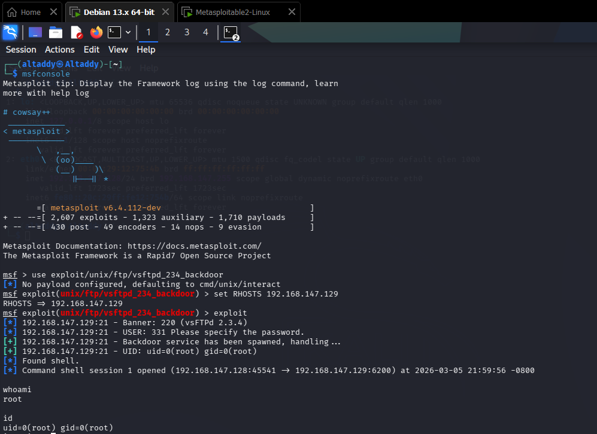
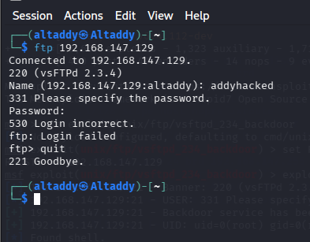
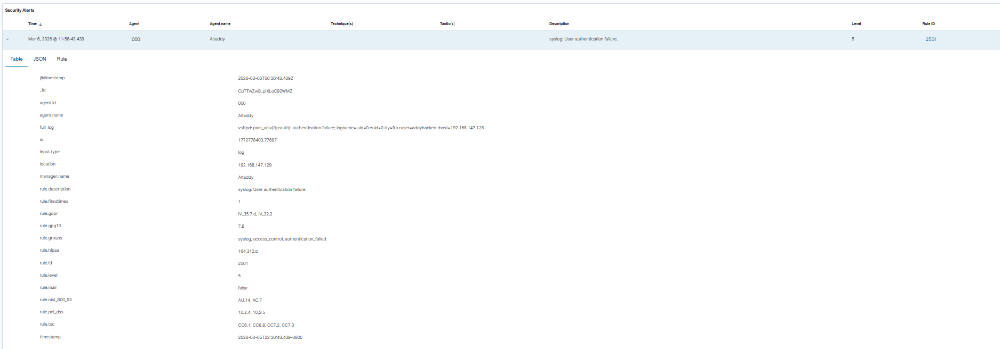
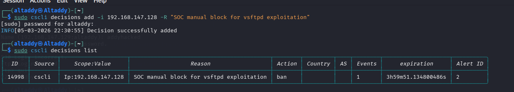

# Task 6: Capstone Project - Full SOC Workflow Simulation

## Objective
Simulate an end-to-end SOC workflow: attack execution, detection, triage, containment, escalation, and reporting.

## 1. Detection and Triage Log

Wazuh detected the suspicious activity generated during exploit execution.

| Timestamp | Source IP | Alert Description | MITRE Technique |
|----------|-----------|-------------------|-----------------|
| 2026-03-06 11:56:43 | 192.168.147.128 | syslog: User authentication failure (vsftpd) | T1190 |

## 2. Response and Containment

- Attack simulated with Metasploit against vulnerable `vsftpd 2.3.4` target.
- Containment applied by blocking attacker IP with CrowdSec decision.
- Verification completed with failed connectivity checks after block.

## 3. Escalation Summary (Tier 2)

High-priority unauthorized access behavior was confirmed against a vulnerable service on the target VM. Initial triage identified exploitation indicators and authenticated shell execution risk. The host was isolated and attacker IP blocked through CrowdSec to prevent lateral movement. Due to root-level compromise potential and service exposure risk, the incident was escalated to Tier 2 for deep investigation, root cause validation, and hardening recommendations.

## 4. Incident Report and Briefing

Supporting report deliverables prepared:
- `Incident Response Report.pdf`
- `Stakeholder Briefing.pdf`

## 5. Artifacts and Evidence

- [Task 5 Screenshots PDF](Task_5_Screenshots.pdf)

1. Attack execution (Metasploit):

2. Failed FTP login attempt:

3. Alert detection (Wazuh):

4. Threat containment (CrowdSec):

