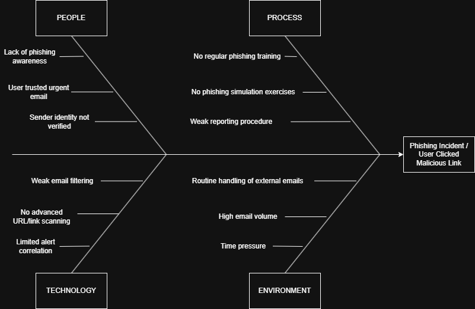
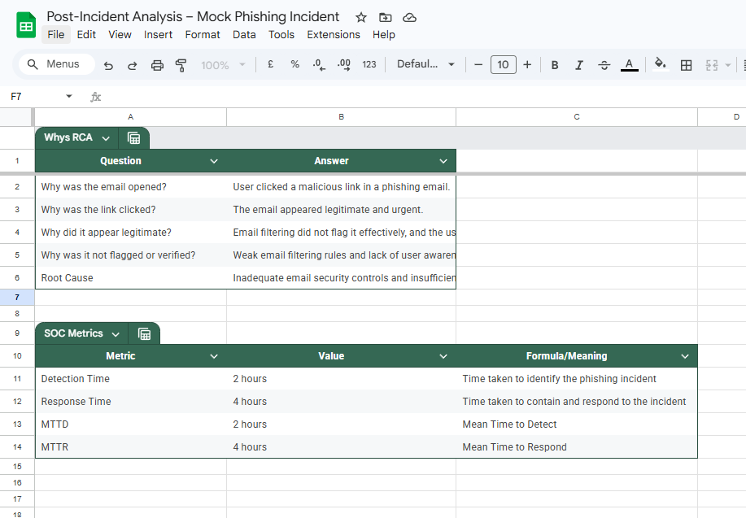

# 3. Post-Incident Analysis

## Overview
A simulated phishing incident was analyzed to identify root causes, evaluate response effectiveness, and derive actionable improvements. The analysis included Root Cause Analysis (RCA), Fishbone Diagram, and SOC metrics evaluation.

---

## Tools Used
- Google Sheets  
- Draw.io  

---

## Tasks Performed
- Conducted Root Cause Analysis using the 5 Whys method  
- Created a Fishbone Diagram to identify contributing factors  
- Calculated SOC metrics (MTTD and MTTR)  
- Documented lessons learned and improvement areas  

---

## Root Cause Analysis (5 Whys)

| Question | Answer |
|----------|--------|
| Why was the email opened? | User clicked a malicious link in a phishing email |
| Why was the link clicked? | The email appeared legitimate and urgent |
| Why did it appear legitimate? | Email filtering did not flag it effectively |
| Why was it not flagged or verified? | Weak filtering rules and lack of awareness |
| Root Cause | Inadequate email security controls and insufficient user training |

---

## Fishbone Diagram

### Fishbone Analysis Insight
The Fishbone Diagram highlights that the phishing incident was caused by a combination of human, technical, and procedural weaknesses. Key contributing factors include lack of user awareness, weak email filtering, absence of structured training programs, and operational pressure.

### Categories Identified
- **People:** Lack of phishing awareness, failure to verify sender  
- **Process:** No regular training, weak reporting procedures  
- **Technology:** Weak email filtering, limited link scanning  
- **Environment:** High email volume, time pressure  

---

## SOC Metrics

### Calculations

- **MTTD (Mean Time to Detect):**  
  Detection Time (11:00) - Delivery Time (09:00) = **2 hours**

- **MTTR (Mean Time to Respond):**  
  Containment Time (15:00) - Detection Time (11:00) = **4 hours**

---

## Metrics Summary 

The mock phishing incident showed an MTTD of 2 hours and an MTTR of 4 hours. Detection was relatively timely, but response and containment took longer. The findings suggest that better monitoring, stronger email filtering, user awareness training, and improved response workflows can enhance overall SOC performance significantly.

---

